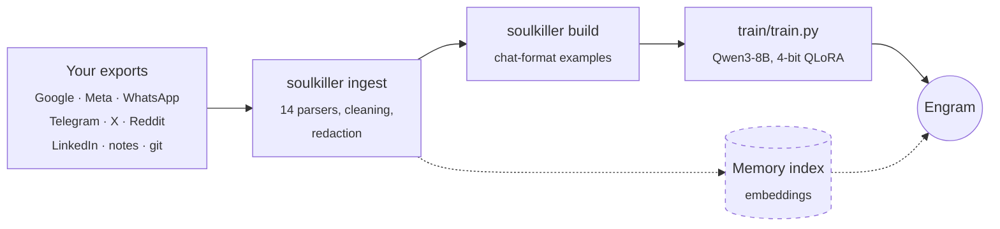
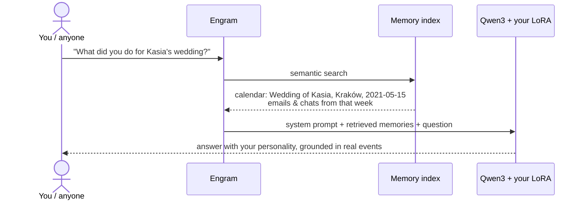

<p align="center">
  
</p>

<h1 align="center">soulkiller</h1>

<p align="center"><i>Train an engram: a local LLM that talks like you and remembers your life, built from your lifetime data.</i></p>

<p align="center">
  <a href="https://jach.me/soulkiller">Website</a> ·
  <a href="#quick-start">Quick start</a> ·
  <a href="#how-it-works">How it works</a> ·
  <a href="#data-sources">Data sources</a> ·
  <a href="#privacy">Privacy</a> ·
  <a href="#roadmap">Roadmap</a>
</p>

Your emails, chats, posts, docs, calendar and browsing history go in. Out comes a fine-tuned Qwen3 that answers in your voice, plus a memory index it can look things up in. Everything runs on your own hardware, and no data leaves your machines.

> [!WARNING]
> The trained model memorizes private details about you and everyone you've talked to. **Never publish it.**

## Quick start

```bash
# 1. Parse your exports (Mac)
uv sync
uv run soulkiller init      # creates config.toml + data/raw/* folders
uv run soulkiller ingest    # parse everything in data/raw/
uv run soulkiller build     # -> data/processed/sft_train.jsonl

# 2. Train (Linux, 16 GB GPU)
pip install -r train/requirements.txt
python train/train.py --model unsloth/Qwen3-8B --out outputs/engram-v1

# 3. Talk to it
python train/chat.py outputs/engram-v1/lora --with "Anna" --channel WhatsApp
```

You need your data exports first, and some of them take days to arrive. See [Usage](#usage) for the full walkthrough.

## How it works

An engram has two halves, because fine-tuning and memory are different problems:

| | Personality | Memory |
|---|---|---|
| **Answers** | *How* would you say this? | *What* happened in your life? |
| **Technique** | QLoRA fine-tune of Qwen3 | Retrieval over an embedding index |
| **Trained on** | Only text **you wrote**: replies, posts, commits | **Everything**: mail, docs, calendar, lifelog |
| **Why** | Fine-tuning captures style, tone, opinions and language mixing | Fine-tuning blurs facts; retrieval recalls them exactly, with dates |
| **Status** | Built | Next |

### Pipeline



1. **Ingest** normalizes every export into two record types (`soulkiller/schema.py`):
   - **`Message`**: one utterance in a conversation (`source, thread_id, timestamp, sender, is_me, text, …`).
   - **`Doc`**: a standalone piece of life (`source, doc_id, timestamp, title, text, authored_by_me, …`).

   Along the way it strips quoted replies (EN and PL), redacts secrets, drops newsletters and fixes Facebook mojibake.
2. **Build** turns conversations, plus your own posts, into training examples.
3. **Train** fine-tunes Qwen3 with loss on your turns only, then exports a LoRA adapter and a GGUF.

### What a training example looks like

Every thread is split into sessions (a pause of 4h or more starts a new one). Each session becomes a multi-turn chat, where other people are `user` and you are `assistant`. The model learns only from your replies; other people's words are just the context you were answering.

<table>
<tr><th>WhatsApp export</th><th>Training example</th></tr>
<tr><td>

```text
12.03.2020, 14:22 - Marek: siema, co tam?
12.03.2020, 14:23 - You: spoko, koduję
i piję kawę
12.03.2020, 14:23 - You: <Media omitted>
12.03.2020, 14:30 - Marek: nice
```

</td><td>

```jsonc
{"messages": [
  {"role": "system",    "content": "You are [your name]. Conversation on WhatsApp with Marek. Date: 2020-03-12."},
  {"role": "user",      "content": "siema, co tam?"},
  {"role": "assistant", "content": "spoko, koduję\ni piję kawę"}  // ← loss only here
]}
// "<Media omitted>" filtered · Marek's trailing "nice" dropped: examples end on your turn
```

</td></tr>
</table>

The system prompt carries **channel, people and date**. At inference you can steer the engram by setting them: *"you on email with your boss in 2015"* versus *"you on Messenger with your brother today"*.

## Data sources

14 sources in total. Each one feeds the personality (text you wrote), the memory, or both.

<details>
<summary><b>Show all sources and what they become</b></summary>

| Source | Parsed from | Becomes | Personality | Memory |
|---|---|---|:-:|:-:|
| **Gmail** | Takeout `*.mbox` | threads by `X-GM-THRID`, quoted history stripped | ✓ | ✓ |
| **Calendar** | Takeout `*.ics` | events with place + attendees | | ✓ |
| **Drive** | Takeout `Drive/` (`.docx` `.pdf` `.txt` `.md` `.html`) | documents | | ✓ |
| **YouTube · Chrome · Maps** | `watch-history.json`, `History.json`, `Timeline.json` | one *lifelog* doc per day | | ✓ |
| **Messenger** | `messages/inbox/*/message_N.json` + E2EE export | chat threads | ✓ | ✓ |
| **Facebook** | `your_posts*.json`, `comments*.json` | posts & comments | ✓ | ✓ |
| **Instagram** | DM `message_N.json` | chat threads | ✓ | ✓ |
| **WhatsApp** | *Export chat* `.txt` (iOS / Android, PL / US formats) | chat threads | ✓ | ✓ |
| **Telegram** | Desktop export `result.json` | chat threads | ✓ | ✓ |
| **X / Twitter** | `tweets.js`, `direct-messages.js` | tweets (no RTs), DMs | ✓ | ✓ |
| **Reddit** | `comments.csv`, `posts.csv` | comments & posts | ✓ | ✓ |
| **LinkedIn** | `messages.csv`, `Shares.csv`, `Profile.csv`, `Positions.csv` | messages, posts, career history | ✓ | ✓ |
| **Notes** | any folder of `.md` / `.txt` (Obsidian etc.) | your notes | | ✓ |
| **Git** | repos listed in `repos.txt` | your commit messages | | ✓ |

</details>

## Usage

### 1. Request your exports

Start now, because some take days. Unpack each one into `data/raw/<folder>/`, and always pick **JSON** and **All time** where offered.

<details>
<summary><b>Where to get each export</b></summary>

| Source | How | Folder |
|---|---|---|
| Gmail, Calendar, Drive, YouTube, Chrome | [takeout.google.com](https://takeout.google.com): select Mail, Calendar, Drive, YouTube, Chrome. For **YouTube → "Multiple formats" → history, pick JSON** (the default is HTML). Use 50 GB `.tgz` parts. | `google/` |
| Maps Timeline | Stored on the phone now: Settings → Location → Location services → Timeline → **Export Timeline data** | `google/` |
| Facebook + Messenger | Accounts Center → Your information and permissions → Download your information → **JSON**, All time | `facebook/` |
| Messenger encrypted chats | Most DMs since 2024 are E2EE and **missing from the export above**. Messenger → Settings → Privacy & safety → End-to-end encrypted chats → Message storage → **Download secure storage data** | `facebook/` |
| Instagram | Accounts Center, same flow, JSON | `instagram/` |
| WhatsApp | Each chat → ⋮ → More → Export chat → **Without media**. Do your top ~20 chats. | `whatsapp/` |
| Telegram | Telegram **Desktop** → Settings → Advanced → Export Telegram data → **JSON** | `telegram/` |
| X / Twitter | Settings → Your account → Download an archive | `twitter/` |
| LinkedIn | Settings → Data privacy → Get a copy of your data → full archive | `linkedin/` |
| Reddit | [reddit.com/settings/data-request](https://www.reddit.com/settings/data-request) | `reddit/` |
| Notes | Copy your Obsidian vault / Markdown in. Apple Notes: export to Markdown first (e.g. the *Exporter* app) | `notes/` |
| Code | `data/raw/git/repos.txt`: one local repo path per line | `git/` |

</details>

> [!TIP]
> A lifetime Takeout can be 20–60 GB. If disk is tight, put `data/` on an external drive and symlink it.

### 2. Parse (Mac)

```bash
uv sync
uv run soulkiller init        # creates config.toml + data/raw/* folders
# edit config.toml: your name, every email you've sent from, every chat display name / handle
uv run soulkiller ingest      # or: --only gmail whatsapp
uv run soulkiller stats       # tokens of *you* per source + senders not recognized as you
uv run soulkiller build       # -> data/processed/sft_train.jsonl, sft_val.jsonl
```

- `stats` lists the top chat senders that weren't matched as you. If any of them *are* you under an old name, add them to `[me].names` and re-ingest.
- Skim a few lines of `sft_train.jsonl` before training: garbage in, garbage soul.
- How much text you need: **under ~200k tokens** of your own writing gives a thin personality; **1M+** gives a strong one.

### 3. Train (Linux, 16 GB GPU)

```bash
rsync -a --exclude .venv --exclude data/raw ./ gpu-box:soulkiller/
ssh gpu-box
cd soulkiller && python -m venv .venv && . .venv/bin/activate && pip install -r train/requirements.txt

python train/train.py --model unsloth/Qwen3-4B --epochs 1 --out outputs/smoke   # quick sanity run
python train/train.py --model unsloth/Qwen3-8B --out outputs/engram-v1          # the real one
python train/chat.py outputs/engram-v1/lora --with "Anna" --channel WhatsApp
```

| Model | Fits 16 GB? | Use for |
|---|---|---|
| `unsloth/Qwen3-4B` | Easily | Fast iteration on the dataset |
| `unsloth/Qwen3-8B` | Yes (default) | The real engram |
| `unsloth/Qwen3-14B` | Tight (lower `--max-seq` / `--batch`) | Best quality, especially Polish |

Output goes to `outputs/<name>/lora` (the adapter) and `outputs/<name>/gguf` (for Ollama, llama.cpp or LM Studio on the Mac).

## Project layout

```
soulkiller/
├── config.example.toml     # who "you" are: name, emails, chat handles
├── soulkiller/
│   ├── cli.py              # init · ingest · stats · build
│   ├── schema.py           # Message / Doc records
│   ├── clean.py            # quote stripping, redaction, encoding fixes
│   ├── build.py            # conversations → chat-format training examples
│   └── sources/            # one parser per export format
├── train/
│   ├── train.py            # Unsloth QLoRA on Qwen3 → LoRA + GGUF
│   └── chat.py             # talk to the result
├── assets/                 # logo: AI portrait (source/) → red LED matrix (make_logo.py)
└── tests/                  # fixture exports for each format
```

## Privacy

- **Local only.** Parsing happens on your Mac and training on your own GPU. No APIs, no cloud.
- **Loss only on your own messages.** Other people's text is used solely as the context you replied to.
- **Redaction at parse time:** passwords, OTP codes, card numbers, IBANs and PESELs. It's best-effort regex, so review the data before training.
- **Noise dropped:** newsletters, bulk mail, spam, trash, system messages and deleted messages.
- **Nothing committed:** `data/`, `outputs/` and `config.toml` are gitignored.

## Roadmap

- [x] Ingestion for 14 sources
- [x] Personality dataset builder
- [x] QLoRA training + GGUF export
- [ ] Memory: multilingual embedding index (`bge-m3`) over messages + docs
- [ ] Engram chat: retrieval-augmented chat with the fine-tuned model
- [ ] Eval: blind test, so friends guess *real you vs engram* on held-out conversations

### Target: talking to it


